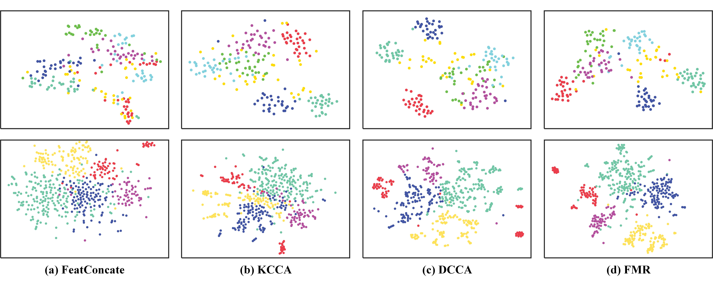

# FMR (Flexible Multi-View Representation Learning for Subspace Clustering)
This is the Matlab implementation of [Flexible Multi-View Representation Learning for Subspace Clustering](https://www.ijcai.org/proceedings/2019/0404.pdf), published in IJCAI 2019.  

Contact: Ruihuang Li (liruihuang@tju.edu.cn)

## Paper
The main contributions include:
* We propose to construct a latent representation by encouraging it to be similar to different views in a weighted way, which implicitly enforces it to encode complementary information from multiple views. 
* We introduce the kernel dependence measure: Hilbert Schmidt Independence Criterion (HSIC), to capture high-order, non-linear relationships among different views, which benefits recovering underlying cluster structure of data.

## Example Results


## Data
In this example, we load Yale dataset with 165 grayscale face images of 15 subjects.

## Run from
demo_FMR.m

## Cite
Please cite following papers if you use this code in your own work:
```
@inproceedings{li2019flexible,
  title={Flexible multi-view representation learning for subspace clustering},
  author={Li, Ruihuang and Zhang, Changqing and Hu, Qinghua and Zhu, Pengfei and Wang, Zheng},
  booktitle={Proceedings of the 28th International Joint Conference on Artificial Intelligence},
  pages={2916--2922},
  year={2019},
}
```
